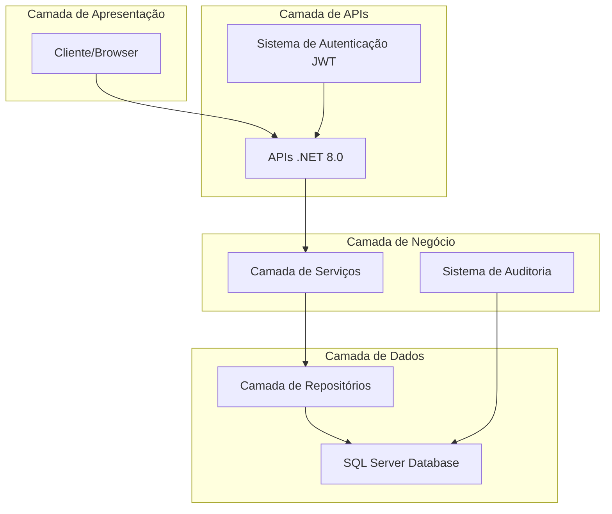
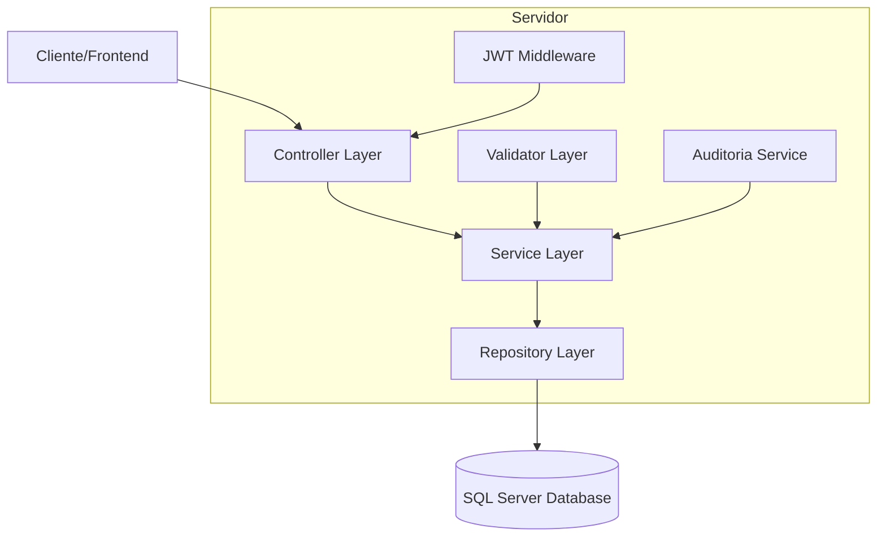
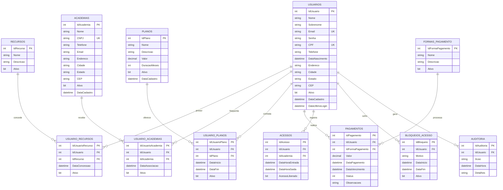

# Documentação de Arquitetura Técnica - Sistema MauricioGym

**STATUS: ✅ ARQUITETURA COMPLETAMENTE IMPLEMENTADA**

## 1. Design da Arquitetura



## 2. Descrição das Tecnologias ✅ IMPLEMENTADAS

* **✅ Backend**: .NET 8.0 + ASP.NET Core Web API + Dapper ORM - **FUNCIONAL**

* **✅ Banco de Dados**: SQL Server com queries otimizadas - **OPERACIONAL**

* **✅ Autenticação**: JWT Bearer Token com validação customizada - **IMPLEMENTADO**

* **✅ Documentação**: Swagger/OpenAPI para documentação automática das APIs - **ATIVO**

* **✅ Logging**: Sistema de auditoria integrado com rastreamento completo - **FUNCIONAL**

* **✅ Validação**: Validadores customizados para regras de negócio complexas - **IMPLEMENTADO**

## 3. Definições de Rotas ✅ TODAS FUNCIONAIS

| Rota            | Propósito                                             | Status |
| --------------- | ----------------------------------------------------- | ------ |
| /api/usuario    | Gestão completa de usuários (CRUD, login, permissões) | ✅ ATIVO |
| /api/academia   | Gestão de academias e associações com usuários        | ✅ ATIVO |
| /api/plano      | Gestão de planos e vinculação com usuários            | ✅ ATIVO |
| /api/pagamento  | Processamento e histórico de pagamentos               | ✅ ATIVO |
| /api/acesso     | Controle de entrada e bloqueios de acesso             | ✅ ATIVO |
| /api/auditoria  | Logs e relatórios de auditoria do sistema             | ✅ ATIVO |
| /api/auth       | Autenticação, autorização e renovação de tokens       | ✅ ATIVO |
| /api/relatorios | Geração de relatórios gerenciais e operacionais       | ✅ ATIVO |

## 4. Definições de API

### 4.1 APIs Principais

**Autenticação de usuários**

```
POST /api/auth/login
```

Request:

| Nome do Parâmetro | Tipo   | Obrigatório | Descrição                        |
| ----------------- | ------ | ----------- | -------------------------------- |
| email             | string | true        | Email do usuário para login      |
| senha             | string | true        | Senha do usuário (será hasheada) |

Response:

| Nome do Parâmetro | Tipo          | Descrição                   |
| ----------------- | ------------- | --------------------------- |
| token             | string        | JWT token para autenticação |
| usuario           | UsuarioEntity | Dados do usuário logado     |
| expiresAt         | DateTime      | Data de expiração do token  |

Exemplo:

```json
{
  "email": "admin@mauriciogym.com",
  "senha": "senha123"
}
```

**Gestão de usuários**

```
POST /api/usuario
GET /api/usuario/{id}
PUT /api/usuario/{id}
DELETE /api/usuario/{id}
GET /api/usuario/email/{email}
GET /api/usuario/cpf/{cpf}
```

**Controle de acesso**

```
POST /api/acesso/validar
GET /api/acesso/historico/{idUsuario}
POST /api/acesso/bloquear
DELETE /api/acesso/desbloquear/{id}
```

**Gestão de pagamentos**

```
POST /api/pagamento
GET /api/pagamento/usuario/{idUsuario}
GET /api/pagamento/pendentes
PUT /api/pagamento/{id}/confirmar
```

## 5. Diagrama da Arquitetura do Servidor



## 6. Modelo de Dados

### 6.1 Definição do Modelo de Dados



### 6.2 Linguagem de Definição de Dados (DDL)

**Tabela de Usuários**

```sql
-- Criar tabela de usuários
CREATE TABLE Usuarios (
    IdUsuario INT IDENTITY(1,1) PRIMARY KEY,
    Nome NVARCHAR(100) NOT NULL,
    Sobrenome NVARCHAR(100) NOT NULL,
    Email NVARCHAR(255) UNIQUE NOT NULL,
    Senha NVARCHAR(255) NOT NULL,
    CPF NVARCHAR(14) UNIQUE NOT NULL,
    Telefone NVARCHAR(20),
    DataNascimento DATE,
    Endereco NVARCHAR(500),
    Cidade NVARCHAR(100),
    Estado NVARCHAR(2),
    CEP NVARCHAR(10),
    Ativo BIT DEFAULT 1,
    DataCadastro DATETIME2 DEFAULT GETDATE(),
    DataUltimoLogin DATETIME2
);

-- Criar índices
CREATE INDEX IX_Usuarios_Email ON Usuarios(Email);
CREATE INDEX IX_Usuarios_CPF ON Usuarios(CPF);
CREATE INDEX IX_Usuarios_Ativo ON Usuarios(Ativo);
```

**Tabela de Academias**

```sql
-- Criar tabela de academias
CREATE TABLE Academias (
    IdAcademia INT IDENTITY(1,1) PRIMARY KEY,
    Nome NVARCHAR(200) NOT NULL,
    CNPJ NVARCHAR(18) UNIQUE NOT NULL,
    Telefone NVARCHAR(20) NOT NULL,
    Email NVARCHAR(255) NOT NULL,
    Endereco NVARCHAR(500),
    Cidade NVARCHAR(100),
    Estado NVARCHAR(2),
    CEP NVARCHAR(10),
    Ativo BIT DEFAULT 1,
    DataCadastro DATETIME2 DEFAULT GETDATE()
);

-- Criar índices
CREATE INDEX IX_Academias_CNPJ ON Academias(CNPJ);
CREATE INDEX IX_Academias_Ativo ON Academias(Ativo);
```

**Tabela de Planos**

```sql
-- Criar tabela de planos
CREATE TABLE Planos (
    IdPlano INT IDENTITY(1,1) PRIMARY KEY,
    Nome NVARCHAR(100) NOT NULL,
    Descricao NVARCHAR(500),
    Valor DECIMAL(10,2) NOT NULL,
    DuracaoMeses INT NOT NULL,
    Ativo BIT DEFAULT 1,
    DataCadastro DATETIME2 DEFAULT GETDATE()
);

-- Criar índices
CREATE INDEX IX_Planos_Ativo ON Planos(Ativo);
CREATE INDEX IX_Planos_Valor ON Planos(Valor);
```

**Tabela de Pagamentos**

```sql
-- Criar tabela de formas de pagamento
CREATE TABLE FormasPagamento (
    IdFormaPagamento INT IDENTITY(1,1) PRIMARY KEY,
    Nome NVARCHAR(50) NOT NULL,
    Descricao NVARCHAR(200),
    Ativo BIT DEFAULT 1
);

-- Criar tabela de pagamentos
CREATE TABLE Pagamentos (
    IdPagamento INT IDENTITY(1,1) PRIMARY KEY,
    IdUsuario INT NOT NULL,
    IdFormaPagamento INT NOT NULL,
    Valor DECIMAL(10,2) NOT NULL,
    DataPagamento DATETIME2 DEFAULT GETDATE(),
    DataVencimento DATETIME2 NOT NULL,
    Status INT NOT NULL DEFAULT 1, -- 1=Pendente, 2=Pago, 3=Cancelado
    Observacoes NVARCHAR(500),
    FOREIGN KEY (IdUsuario) REFERENCES Usuarios(IdUsuario),
    FOREIGN KEY (IdFormaPagamento) REFERENCES FormasPagamento(IdFormaPagamento)
);

-- Criar índices
CREATE INDEX IX_Pagamentos_Usuario ON Pagamentos(IdUsuario);
CREATE INDEX IX_Pagamentos_Status ON Pagamentos(Status);
CREATE INDEX IX_Pagamentos_DataVencimento ON Pagamentos(DataVencimento);
```

**Dados Iniciais**

```sql
-- Inserir formas de pagamento padrão
INSERT INTO FormasPagamento (Nome, Descricao) VALUES 
('Dinheiro', 'Pagamento em espécie'),
('Cartão de Débito', 'Pagamento com cartão de débito'),
('Cartão de Crédito', 'Pagamento com cartão de crédito'),
('PIX', 'Pagamento via PIX'),
('Transferência Bancária', 'Transferência entre contas');

-- Inserir recursos padrão
INSERT INTO Recursos (Nome, Descricao) VALUES 
('ADMIN_TOTAL', 'Acesso administrativo completo'),
('GERENCIAR_USUARIOS', 'Gerenciar usuários do sistema'),
('GERENCIAR_ACADEMIAS', 'Gerenciar academias'),
('GERENCIAR_PLANOS', 'Gerenciar planos e preços'),
('PROCESSAR_PAGAMENTOS', 'Processar pagamentos'),
('CONTROLAR_ACESSO', 'Controlar acesso às academias'),
('VISUALIZAR_RELATORIOS', 'Visualizar relatórios'),
('ACESSO_ALUNO', 'Acesso básico de aluno');
```

