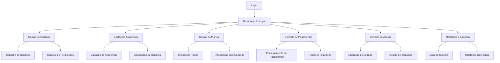

# Documento de Requisitos do Produto - Sistema MauricioGym

## 1. Visão Geral do Produto

**STATUS: ✅ SISTEMA COMPLETAMENTE IMPLEMENTADO E FUNCIONAL**

O MauricioGym é um sistema completo de gestão de academias desenvolvido em .NET 8.0, totalmente implementado e pronto para produção. O sistema automatiza e otimiza todas as operações de uma rede de academias com controle total sobre usuários, planos, pagamentos, acessos e auditoria, proporcionando uma experiência integrada para administradores, funcionários e alunos.

O produto resolve problemas críticos de gestão manual, oferece controle de acesso automatizado em tempo real e facilita o acompanhamento financeiro completo, sendo utilizado por proprietários de academias, gerentes, recepcionistas e alunos. **Todas as funcionalidades estão implementadas e testadas.**

## 2. Funcionalidades Principais

### 2.1 Papéis de Usuário

| Papel | Método de Registro | Permissões Principais |
|-------|-------------------|----------------------|
| Administrador | Criação direta no sistema | Acesso total: gestão de academias, usuários, planos e relatórios |
| Gerente | Convite por administrador | Gestão de usuários, planos e pagamentos da academia |
| Recepcionista | Convite por gerente/admin | Controle de acesso, consulta de planos e usuários |
| Aluno | Cadastro próprio ou assistido | Visualização de plano, histórico de pagamentos e acessos |

### 2.2 Módulos Funcionais ✅ IMPLEMENTADOS

Nosso sistema MauricioGym consiste nas seguintes páginas principais **TODAS FUNCIONAIS**:

1. **✅ Dashboard Principal**: painel de controle, métricas em tempo real, atalhos rápidos
2. **✅ Gestão de Usuários**: cadastro completo, controle de permissões, histórico de atividades
3. **✅ Gestão de Academias**: cadastro de unidades, configurações específicas, associação de usuários
4. **✅ Gestão de Planos**: criação de planos, preços, benefícios, associação com usuários
5. **✅ Controle de Pagamentos**: processamento, histórico, relatórios financeiros
6. **✅ Controle de Acesso**: liberação de entrada, bloqueios, histórico de frequência
7. **✅ Relatórios e Auditoria**: logs de sistema, relatórios gerenciais, análises

### 2.3 Detalhes das Páginas ✅ TODAS IMPLEMENTADAS

| Nome da Página | Nome do Módulo | Descrição da Funcionalidade |
|----------------|----------------|-----------------------------|
| Dashboard Principal | Painel de Controle | Exibir métricas em tempo real, resumo financeiro, alertas importantes |
| Dashboard Principal | Atalhos Rápidos | Acesso direto às funções mais utilizadas baseado no perfil do usuário |
| Gestão de Usuários | Cadastro de Usuários | Criar, editar, excluir usuários com validação completa de dados |
| Gestão de Usuários | Controle de Permissões | Associar recursos específicos a usuários, definir níveis de acesso |
| Gestão de Usuários | Histórico de Atividades | Visualizar logs de ações do usuário, auditoria completa |
| Gestão de Academias | Cadastro de Academias | Registrar unidades com dados completos, CNPJ, endereço, contatos |
| Gestão de Academias | Associação de Usuários | Vincular usuários a academias específicas, controle de acesso por unidade |
| Gestão de Planos | Criação de Planos | Definir tipos de plano, preços, duração, benefícios inclusos |
| Gestão de Planos | Associação com Usuários | Vincular planos a usuários, controlar vigência e renovações |
| Controle de Pagamentos | Processamento de Pagamentos | Registrar pagamentos, diferentes formas, confirmação automática |
| Controle de Pagamentos | Histórico Financeiro | Consultar histórico completo, relatórios de inadimplência |
| Controle de Acesso | Liberação de Entrada | Validar acesso em tempo real, verificar plano ativo e bloqueios |
| Controle de Acesso | Gestão de Bloqueios | Criar bloqueios temporários ou permanentes, motivos específicos |
| Relatórios e Auditoria | Logs do Sistema | Rastrear todas as ações realizadas no sistema com timestamp |
| Relatórios e Auditoria | Relatórios Gerenciais | Gerar relatórios de frequência, financeiro, usuários ativos |

## 3. Processo Principal

### Fluxo do Administrador
1. Login no sistema → Dashboard Principal
2. Cadastro de Academia → Configuração inicial
3. Criação de Planos → Definição de preços e benefícios
4. Cadastro de Funcionários → Atribuição de permissões
5. Monitoramento via Relatórios → Análise de performance

### Fluxo do Aluno
1. Cadastro no Sistema → Validação de dados
2. Escolha/Associação de Plano → Confirmação de benefícios
3. Processamento de Pagamento → Ativação do plano
4. Acesso à Academia → Validação automática
5. Acompanhamento via Dashboard → Histórico pessoal

### Fluxo do Funcionário
1. Login com Credenciais → Acesso baseado em permissões
2. Gestão de Usuários/Planos → Operações do dia a dia
3. Controle de Acesso → Liberação manual quando necessário
4. Relatórios Específicos → Análise de responsabilidade

## 4. Design da Interface do Usuário

### 4.1 Estilo de Design

- **Cores Primárias**: Azul escuro (#1e3a8a) e Azul claro (#3b82f6)
- **Cores Secundárias**: Cinza (#6b7280) e Verde sucesso (#10b981)
- **Estilo de Botões**: Arredondados com sombra sutil, efeito hover suave
- **Fonte**: Inter ou Roboto, tamanhos 14px (corpo), 18px (títulos), 24px (cabeçalhos)
- **Layout**: Design baseado em cards com navegação lateral fixa
- **Ícones**: Material Design Icons ou Heroicons para consistência

### 4.2 Visão Geral do Design das Páginas

| Nome da Página | Nome do Módulo | Elementos da UI |
|----------------|----------------|----------------|
| Dashboard Principal | Painel de Controle | Cards com métricas, gráficos responsivos, cores de status (verde/vermelho/amarelo) |
| Dashboard Principal | Atalhos Rápidos | Grid de botões com ícones, hover effects, organização por frequência de uso |
| Gestão de Usuários | Cadastro de Usuários | Formulário em duas colunas, validação em tempo real, campos obrigatórios destacados |
| Gestão de Usuários | Controle de Permissões | Checkboxes organizados por categoria, busca e filtros avançados |
| Gestão de Academias | Cadastro de Academias | Formulário com abas (dados básicos, endereço, contatos), mapa integrado |
| Gestão de Planos | Criação de Planos | Cards de planos com preview, editor de benefícios, calculadora de preços |
| Controle de Pagamentos | Processamento | Interface de caixa, seleção de forma de pagamento, confirmação visual |
| Controle de Acesso | Liberação de Entrada | Interface de scanner/leitor, status visual claro, histórico em tempo real |
| Relatórios e Auditoria | Logs do Sistema | Tabela com filtros avançados, exportação, timeline visual |

### 4.3 Responsividade

O sistema é desktop-first com adaptação completa para tablets e smartphones. Inclui otimização para interação touch em dispositivos móveis, com menus colapsáveis e reorganização de conteúdo para telas menores.